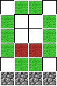
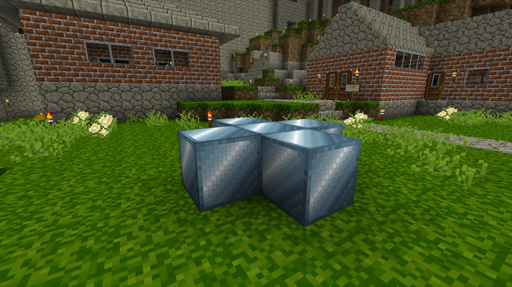
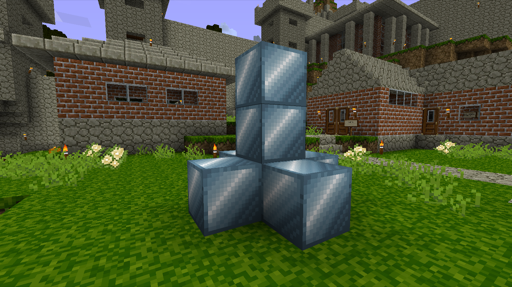

# Lathund plugins & kortkommandon

## Index
- [Sammanfattning](#sammanfattning)
- [Plugins](#plugins)
	- [BigDoors](#bigdoors)
	- [BigDoorsOpener](#bigdoorsopener)
	- [BuildPortals](#buildportals)
	- [Cannons](#cannons)
	- [ChestSort](#chestsort)
	- [Coins](#coins)
	- [LandLord](#landlord)
	- [LockettePro](#lockettepro)
	- [Mcmmo](#mcmmo)
	- [MobRepellent](#mobrepellent)
	- [MoveCraft](#movecraft)
	- [MythicMobs](#mythicmobs)
	- [QuickShop](#quickshop)
	- [SmoothSleep](#smoothsleep)
	- [TreasureHunt](#treasurehunt)
	- [UserLogin](#userlogin)

## Sammanfattning
Här är en översikt över de plugins och kommandon som finns tillgängliga.  
Gör ett inlägg i Facebookgruppen om ni saknar ett plugin, stöter på buggar eller har åsikter.

Ni får tåla Svengelskan då det mesta är kopierat direkt från pluginens wiki.

## Plugins

### BigDoors
**OBS! Att skapa ett objekt med BigDoors kostar ingame valuta (100 + (5 x blockCount) GP)**  
Används för att skapa rörliga dörrar, klaffbroar m.m. av block.  
[Mer info](https://www.spigotmc.org/resources/big-doors.58669/)

#### Commands
`/BigDoors`, `/BDM`  
Allows you to access the BigDoors GUI.

`/NewDoor <DoorName>`  
Initiate door creation process.

`/NewPortcullis <PortcullisName>`  
Initiate the portcullis creation process.

`/NewDrawbridge <DrawbridgeName>`  
Initiate the drawbridge creation process.

`/SetBlocksToMove <doorUID> <blocksToMove>`  
Sets the number of blocks this door will try to move.  
Only applies to doors such as portcullises and sliding doors.

`/SetDoorRotation <doorUID> <direction>`  
Changes the direction a door will try to move.

`/NameDoor <doorName>`  
Sets the name of the door when you're in a door creation process.

`/BDCancel`  
Cancel object creation process.

`/DelDoor <DoorName>`  
Allows you to delete a Big Door.

`/OpenDoor <DoorName> [DoorName2] ... [DoorNameX]`  
Allows you to open a Big Door (of any type). Also allows opening more than 1 door at a time.

`/CloseDoor <DoorName> [DoorName2] ... [DoorNameX]`  
Allows you to close a Big Door (of any type).

`/ToggleDoor <DoorName> [DoorName2] ... [DoorNameX]`  
Allows you to open a Big Door (of any type) when it is closed or close it when it's open.

`/ListDoors <DoorName || PlayerName || PlayerUUID>`  
List all doors owned by you, with a specific name if provided.

`/DoorInfo <DoorName>`  
Allows you to get information about a given door.

`/ChangePowerBlockLoc <DoorName>`  
Allows you to change the location of the powerblock of a given door.

`/InspectPowerBlockLoc`  
Gives you a tool that gives you the door info of any powerblock you hit with it.

`/BigDoors AddOwner <doorUID> <playerName>`  
Adds another user as an owner of the given door.

`/BigDoors RemoveOwner <doorUID> <playerName>`  
Removes another user as an owner of the given door.

`/SetAutoCloseTime <doorUID> <autoCloseTime>`  
Sets the amount of time after which a door will try to close itself after it was opened. Negative values mean the door will not try to automatically close (you can still use redstone, of course).

#### Tutorial
When you want to create an animated object of any type, don't worry. There's an in-game guide to help you with it!  

When you have built a door that you would like to open, you start the door creation process using `/NewDoor <DoorName>`, where you substitute `<DoorName>` for any (non-numerical) name you'd like to give it.

Alternatively, you can open the BigDoor Menu using `/BigDoorMenu` (or `/BDM` for short) and use the `New Door` button in the GUI and choose a name using `/NameDoor <DoorName || DoorUID>`, as the instructions will tell you.

Next, you will need to define the region of the door. Just select two points on the door as far away from each other as possible, e.g. top-left and bottom right. You then need to define where the rotation point (or: hinge) is, so the plugin not only knows where the door is but also how to open it. This is done by selecting a column of blocks on the side you want the door to rotate around.  
And that's it! 

You can now start using the door using `/OpenDoor <DoorName || DoorUID>` or find the door in the list shown in this plugin's GUI (sorted by door ID, i.e. creation date, for now) and use the switch there.  
If you want to use redstone to open a door, you can do that too! Simply place the `power block` (**Gold Block**) under the rotation point/hinge.

Place a `Gold Block` below the door hinge to control the door with redstone logic.

[[Back to top]](#index)

***

### BigDoorsOpener
Används för att sätta speciella conditions för att öppna eller stänga objekt skapade med BigDoors, t.ex. tidpunkt på dygnet, en nyckel m.m.  

#### Commands
[Översikt kommandon](https://github.com/eldoriarpg/BigDoorOpener/wiki/Commands)  
All commands should start with **`/bdo`**  

`setCondition <doorId> <condition> <conditionValues>`  
Set a condition for a door. Note: Conditions are combined in groups. This will remove all conditions of the same group.

`addCondition <doorId> <condition> <conditionValues>`  
Set a condition for a door. This allows you to add multiple conditions of the same group to the door.

`removeCondition <doorId> <condition> [condition id]`  
Remove a condition from a door.

`copyCondition <sourceDoorId> <targetDoorId> [condition]`  
Copy one or all condition from one door to another.

`cloneDoor <sourceDoorId> <targetDoorId>`  
Clone the settings of a door to another. This includes conditions as well.

`info <doorId>`  
Get information about this door.

`unregister <doorId>`  
Remove all conditions for a door.

`invertOpen <doorId>`  
Invert the state of the door. Useful if you created it in a opened state.

`stayOpen <doorId> <seconds>`  
Set the seconds a door will stay open when fully opened.

`list`  
Get a list of all your registered doors.

#### Conditions
[Översikt conditions](https://github.com/eldoriarpg/BigDoorOpener/wiki/Conditions)

[[Back to top]](#index)

***

### BuildPortals
Bygg portaler för att teleportera mellan två punkter.  
[Mer info](https://www.spigotmc.org/resources/buildportals.21922/)

#### Tutorial
1. Skapa en portal av **`Emerald Blocks`**
2. Placera aktiveringsblocken i portalen. Godkända aktiveringsblock är **`Gold Block`**, **`Redstone Block`** och **`Diamond Block`**.
3. Skapa en likadan portal med samma typ av aktiveringsblock vid portalens destination

#### Ritning:

[[Back to top]](#index)

***

### Cannons
**OBS! Att skapa en kanon kostar ingame valuta (100 - 200 GP)**  
Skapa och avfyra kanoner.

#### Tutorial
[Tutorial](https://dev.bukkit.org/projects/cannons/pages/tutorial)

Bygg valfri kanon enligt ritningarna. Du får ett meddelande om du har gjort rätt.  
Betala för kanonen med kommandot `/cannons buy`, klicka sedan på kanonen.  

Ladda sedan kanonen genom att högerklicka på den med krut i handen.  
Ladda sedan en projektil på samma sätt, se listan **Projektiler**.

Sikta manuellt genom att högerklicka på kanonens sidor och topp med tom hand.  
För att automatiskt sikta högerklickar du på kanonen med föremålet **`CLOCK`**

Skjut genom att högerklicka på facklan med tom hand.

#### Commands
[Översikt kommandon](https://dev.bukkit.org/projects/cannons/pages/commands)

All commands should start with **`/cannons`** 

`build`  
This command gives you a short introduction how to build a cannon.

`fire`  
Gives info on how to fire a cannon.

`dismantle`  
Allows the owner of a cannon to deconstruct the cannon. The player will receive a deconstruction refund.

`rename <OLD_NAME> <NEW_NAME>`  
When you build a new cannon the plugin will use the next free name for the cannon. Since 'Cannon11' does not look nice you have the possibility to change the name.

`info`  
Very simple command that gives you the name and design of a cannon. Type in the command and right click on the cannon to get the information.

`list`  
Since the amount of cannons can be limited for one player it might be interesting to know where these cannons are.

`whitelist add <NAME>`  
Allows the owner of the cannon to add players to the whitelist of a cannon. Just use the command and click on the cannon.

`whitelist remove <NAME>`  
Allows the owner of the cannon to remove players from the whitelist of a cannon. Just use the command and click on the cannon.

`reset`  
You built too many cannons and no idea where they are? This command will remove all your cannons from the database.

#### Projektiler
| Type | Block |
|---|---|
| Canister shot | `GRAVEL BLOCK` |
| Cannonball | `COBBLESTONE BLOCK` |
| Heavy cannonball | `STONE BLOCK` |
| Hardened cannonball | `DIAMOND BLOCK` |
| Teleporter projectile | `ENDER PEARLK` |
| Fireworks | `FIREWORK ROCKET` |
| Clusterbomb | `TNT BLOCK` |

[[Back to top]](#index)

***

### ChestSort
Sorterar automatiskt items i kistor och inventory.

#### Hotkeys
| Key | Action |
|---|---|
| **Left-Click a container** | Sorts the clicked container (chest, barrel, shulker box, etc.) |
| **Left-Click outside inventory** | Puts all matching stuff (except hotbar) into the chest, barrel etc. |
| **Double-Left-Click outside inventory** | Puts all items (except hotbar) into the chest, barrel etc. |
| **Right-Click outside inventory** | Puts matching items from the chest, barrel etc. into your inventory |
| **Double-Right-Click outside inventory** | Empties the whole chest, barrel etc. into your inventory |

#### Commands
`/sort`  
Toggle automatic chest sorting.

`/sort hotkeys`  
Open the hotkeys GUI to enable/disable hotkeys per player.

`/invsort toggle`
Toggle automatic inventory sorting

[[Back to top]](#index)

***

### Coins
Valutaplugin. Valutan kan användas för att köpa items, använda vissa plugins m.m.  

#### Commands
`/withdraw <amount>`  
Withdraw some currency into physical coins

`/balance`  
See your current balance

`/pay <player> <amount>`  
Send currency to player

[[Back to top]](#index)

***

### LandLord
Köp landområden och sätt regler för dessa.

#### Tutorial
Köp först och främst en claim i shoppen i spawnområdet.  
Claims används för att köpa land.

Gå sedan till det område du vill köpa.  
Öppna landkartan med `/land map` för att se vilket område du står i.

Köp området med `/land claim`, eller `/land multiclaim` om du vill köpa ett större område.

Använd `/land borders` för att se gränserna för ditt landområde.

Med `/land manage` kan du ställa in reglerna för ditt landområde, t.ex. vem som kan öppna kistor, bygga osv.

#### Commands
All commands should start with the prefix `/land`

`help`  
Displays the help menu. You can click in the chat to navigate the menu.

`claim`  
Allows to claim the land you are standing on. Also allows to buy up the land of inactive players or advertised lands.  
One command for all the actions. Different chat messages are indicating if a player is buying a free land, an inactive or an advertised one.

`multiclaim <option>`  
Claims multiple lands at once. Requires the a claiming option as parameter.  
Options are "circular" (not yet implemented) or "rectangular".  
All the individual claim actions are redirected to the function that handles /land claim, so multiclaim might show a higher land claim count then the amount of lands than actually will be claimed.

`unclaim`  
Unclaims the land you are standing in. Returns 80% of investment cost.

`addfriend <player1> <player2> ...`  
Adds the selected players as friends in the land you are standing in.

`addfriendall <player>`  
Adds the selected player as a friend in all your lands.

`unfriend <player1> <player2> ...`  
Removes the selected players as friends from the land you are standing in.

`unfriendall <player>`  
Removes the selected player as a friend from all your lands.

`manage`  
Opens the land management GUI for the land you are standing in.  
Here you can change the greet- and leave message, change permissions and more.

`manageall`  
Same as above, but for all your lands.

`list <player>`
Lists all lands of selected player. Leave empty to list your own lands.  

`info`  
Shows info of the land you are currently standing in.  
Boundaries are highlighted with particles.

`map`  
Toggles the land map. Use again to hide map.

`claims`  
Shows the amount of claims you have available.

`borders`  
Toggles borders for the land you are standing in. Use again to disable.

`advertise`  
Advertise the land you are currently standing on, meaning another player can buy it for the price you set.

`removeadvertise`  
Remove an advertisement from the land you are currently standing in.

[[Back to top]](#index)

***

### LockettePro
**OBS! Att låsa ett objekt kostar ingame valuta (20 GP)**  
Lås dörrar, kistor m.m.  
[Mer info](https://www.spigotmc.org/resources/lockettepro-for-1-14-1-15-1-16.74354/)

#### Tutorial
For players, just hold a sign in your hand, then right click a chest or any lockable block.  
If you want to lock a door, you may put a sign on the block above or below the door too.  

You may also `SHIFT+RIGHT CLICK` the block to prevent it get automatically locked, or you can write `[Private]` text manually on signs as well.

**Share the chest with another user:**  
After claiming the chest, you can add another user on the sign. First, right click the sign, then enter `/lock 3 <user name>`  

**Share the chest with everyone:**  
Same as above, you just use `[Everyone]` in the username.

**Add another sign:**  
If one sign is not enough, you may hold a sign and right click on another surface.  
It will snap on the surface and become a `[More User]` sign automatically.  
Placing the sign while holding `SHIFT` will bypass the sign creation.

**Timer with doors:**  
If you add a line `[timer:<int>]` to a door lock, the door will automatically close after `<int>` seconds.

#### Commands
`/lock <line number [1-4]> <text>`  
Edit line number on selected lock sign

[[Back to top]](#index)

***

### Mcmmo
Ramverk för att levla och använda skills. Man tappar 5% av sina levels när man dör.  
[Mer info](https://mcmmo.org/wiki/Main_Page)

#### Commands
`/stats`  
See current character statistics

`/party `  
Check party information.

`/party create <party-name> <password>`  
Create a party

`/party join <player> <password>`  
Join a players party

`/party invite <player>`  
Invite a player to join your party

`/party accept <player> ` 
Accept a party invite

`/party password <password>`  
Set a password for the party you currently own

`/party kick <player-name>`  
Kick a player from the party.

#### Skills
- [Acrobatics](#acrobatics)
- [Archery](#archery)
- [Axes](#axes)
- [Swords](#swords)
- [Unarmed](#unarmed)
- [Excavation](#excavation)
- [Fishing](#fishing)
- [Herbalism](#herbalism)
- [Mining](#mining)
- [Woodcutting](#woodcutting)
- [Alchemy](#alchemy)
- [Repair](#repair)
- [Taming](#taming)

#### Acrobatics
Level acrobatics by taking fall damage, successfully rolling and dodging attacks.

##### Graceful Roll (active skill)
Doubles roll chance. Activate by holding the sneak button while falling.

##### Roll (passive skill)
Chance to negate fall damage based on the player's acrobatics skill. Caps out at 50% chance at level 100.

##### Dodge (passive skill)
Chance to halve incoming damage. Caps out at 25% chance at level 100.
Does not work for lethal damage.

[[Back to skill index]](#skills)
---
#### Archery
Lever archery by dealing damage with bow and arrows based on the distance to the target.

##### Skill Shot (passive skill)
Each level of skillshot increases the damage dealt with bow and arrows. Caps out at 100% increased damage at level 100.  
Max damage on a single shot is capped at 12.

##### Daze (passive skill)
Chance to daze an opponent on hit. Caps out at 45% chance at level 100.  
Only works in PVP.

##### Retrieve (passive skill)
Chance to retrieve fired arrows. Caps out at 60% at level 100.

[[Back to skill index]](#skills)
---
#### Axes
Level this skill by dealing damage with axes.

##### Skull Splitter (active skill)
Unlocks at level 30. Activate by right clicking with an axe in hand.  
Adds an area of effect to axe attacks, dealing less damage to the primary target. Duration based on level in axes.

##### Axe Mastery (passive skill)
Increases the damage done with axes. Caps out at 40% at level 100.

##### Critical Strikes (passive skill)
Chance to increase damage on a hit by 20% vs players and 50% vs mobs. Caps out at 30% chance at level 100.

##### Armor Impact (passive skill)
Chance to inflict increaesed durability damage on an enemys armor. Caps out at 25% chance at level 100.

##### Greater Impact (passive skill)
Chance to inflict a greater knockback effect on hit. Caps out at 15% chance at level 50.

[[Back to skill index]](#skills)
---
#### Swords
Level this skill by dealing damage with swords.

##### Serrated Strikes (active skill)
Unlocks at level 30. Activate by right clicking with a sword in hand.  
Adds an area of effect to sword attacks, inflicting bleed damage on enemies. Duration based on level in swords.

##### Counter Attack (passive skill)
Unlocks at level 28. Chance to reflect a portion of the damaged suffered back to the attacker.  
Caps out at 20% chance at level 100.

##### Rupture (passive skill)
Chance to inflict damage over time on attack. Caps out at 35% chance at level 90.

[[Back to skill index]](#skills)
---
#### Unarmed
Level this skill by dealing damage with your bare hands.

##### Berserk (active skill)
Unlocks at level 30. Activate by right clicking with a mob in your crosshair, then left click.  
Gives a damage boost and allows you to break blocks with no blast resitance much faster. Duration increases with levels in unarmed.

##### Arrow Deflect (passive skill)
Unlocks at level 35. Chance to deflect arrows back at the attacker.  
Caps out at 33% chance at level 100.

##### Disarm (passive skill)
Unlocks at level 45. Chance to disarm an opponent in PVP.  
Caps out at 20% chance at level 100.

##### Iron Arm Style (passive skill)
Increases damage done with unarmed attacks. Caps out at 3 bonus damage at level 100.

##### Iron Grip (passive skill)
Unlocks at level 60. Chance to negate disarm.  
Caps out at 100% at level 100.

##### Limit break (passive skill)
Adds raw damage to unarmed PVP attacks depending on the armor the target is wearing.

[[Back to skill index]](#skills)
---
#### Excavation
Level excavation by digging certain blocks with a shovel.

##### Giga Drill Breaker (active skill)
Unlocks at level 35. Activate by right clicking with a shovel and digging immediately after.  
Makes the shovel dig much faster for a short duration. Increases duration for each level in excavation.

##### Archaeology (passive skill)
Chance for block dug with a shovel to drop treasures. Chance for better drops increases with each level in excavation.

[[Back to skill index]](#skills)
---
#### Fishing
Level fishing by fishing. Duh.

##### Ice Fishing (active skill)
Unlocks at level 18. Ability to fish in icy biomes.

##### Shake (active skill)
Unlocks at level 25. Use the fishing pole on mobs to shake items off of them.

##### Treasure Hunter (passive skill)
Chance to find treasures when fishing. Chance for better treasures increases with each level in fishing.

##### Master Angler (passive skill)
Improves the chance of getting a bite while fishing.

##### Fisherman's Diet (passive skill)
Improves the hunger restored from eating fish.

##### Magic Hunter (passive skill)
Chance to find enchanted items while fishing. Chance increases with each level in fishing.

[[Back to skill index]](#skills)
---
#### Herbalism
Level herbalism by breaking blocks that are considered crops. Crop blocks that have several stages of growth will only yield experience when they are fully grown.

##### Green Terra (active skill)
Unlocked at level 25. Activate by right clicking any block (except dirt) with a hoe and then harvesting crops with it.  
Harvested crops will yield triple drops and be automatically replanted at a high growth level. Replanting requires the appropriate seeds in inventory.

##### Green Thumb (Blocks) (passive skill)
Apply moss to dirt, cobblestone or stone bricks by right clicking on it with wheat seeds.  
Chance to successfully plant moss increases with herbalism level and caps out at 65% at level 100.

##### Green Thumb (Crops) (passive skill)
Chance to automatically replant crops upon harvesting. Chance caps out at 65% at level 100.

##### Shroom Thumb (passive skill)
Turn dirt into mycelium by right clicking on it with a mushroom. Requires both red and brown mushrooms in inventory and will consume one of each.  
Chance to successfully turn a dirt block into mycelium increases with each level in herbalism and caps out at 35% at level 100.

##### Double Drops (passive skill)
Chance to recieve double drops when harvesting crops. Caps out at 35% chance at level 100.

##### Farmer's Diet (passive skill)
Increases the amount of hunger restored from grown food, depending on level in herbalism.

##### Hylian Luck (passive skill)
Chance to find rare items on breaking certain blocks (dead bushes, flowers, flower pots). Caps out at 10% at level 100.

[[Back to skill index]](#skills)
---
#### Mining
Level mining by breaking certain blocks (ore, stone, bricks etc.) with a pickaxe or with Blast Mining.

##### Super Breaker (active skill)
Unlocks at level 25. Activate by right clicking on a mineable block and then left clicking on said block.  
Increases the speed at which you mine for the duration of the ability. Duration increases with each level of mining.

##### Blast Mining (active skill)
Unlocks at level 12. Activate by holding the sneak button and right clicking a TNT block when out of block selection range.  
Allows you to use TNT to mine ore, with a chance to gain more ore drops and less debris (cobblestone).

##### Double Drops (passive skill)
Chance to recieve double drops from mining blocks. Caps out at 45% chance at level 100.

##### Bigger Bombs (passive skill)
Increases the radius of the Blast Mining explosion. Caps out at a 140% increase at level 100.

##### Demolitions Expertise (passive skill)
Reduces damage recieved from TNT explosions. Caps out at 30% at lvl 100.

[[Back to skill index]](#skills)
---
#### Woodcutting
Level this skill by harvesting wood and mushroom blocks.

##### Tree Feller (active skill)
Unlocks at level 12. Activate by right clicking on a non-log block with an axe then breaking a wood block.  
Automatically breaks all blocks in a tree, up to a certain size. Higher levels increases the size of trees that can be harvested.

##### Harvest Lumber (passive skill)
Chance to harvest an additional log. Caps out at 33% at level 100.

[[Back to skill index]](#skills)
---
#### Alchemy
Level this skill by crafting potions and adding additional ingredients to potions.

##### Catalysis (passive skill)
Increases the speed of potion brewing. Caps out at a 150% increase at level 100.

##### Concoctions (passive skill)
Ability to add more ingredients to potions.

[[Back to skill index]](#skills)
---
#### Repair
Level this skill by repairing items.

##### Arcane Forging (passive skill)
Allows you to repair items with a chance to retain it's enchantments. 
Enchantments has a chance to be kept at the current level, downgraded or lost, depending on level in repair.

##### Repair Mastery (passive skill)
Increases the repair amount depending on level in repair.

##### Super Repair (passive skill)
Chance to double the repair amount when repairing. Caps out at 50% at level 100.

[[Back to skill index]](#skills)
---
#### Taming
Level this skill by taming peaceful mobs.

##### Beast Lore (active skill)
Unlocks at level 1. Activate by left clicking a wolf, horse or ocelot with a bone.  
Prints information about the pet.

##### Call of the Wild (active skill)
Unlocks at level 30. Use by holding the sneak button and left clicking into the air with the specific items in hand.  
For a wolf, hold 10 bones. For an ocelot, hold 10 raw fish. For a horse hold 10 apples.

##### Gore (passive skill)
Adds a critical strike chance to your pets. Caps out at 35% chance at level 100.

##### Environmentally Aware (passive skill)
Pets avoid cactuses and lava and gains immunity to fall damage.

##### Fast Food Service (passive skill)
Wolves have a 30% chance to heal when attacking.

##### Pummel (passive skill)
Wolves have a 10% chance to knock back foes.

##### Thick Fur (passive skill)
Pets gain a 25% damage reduction.

##### Holy Hound (passive skill)
Wolves heal when attacked by magic or poison.

##### Shock Proof (passive skill)
Pets gain a 75% resitance to explosion damage.

##### Sharpened Claws (passive skill)
Pets gain a 40% damage boost.

[[Back to skill index]](#skills)
---
#### Salvage
Salvage is a subskill, which means it can't be levelled through regular means.  
Your salvage level is determined by the average of your repair and fishing skills.

##### Advanced Salvage (active skill)
Allows you to salvage items to regain some of the materials. Higher salvage level means you get more of the original materials back.  
Use by right clicking a gold block while holding the item you want to salvage.

##### Arcane Salvaging (active skill)
Allows you to get enchanted books when salvaging enchanted items. Higher level increases the chance of salvaging an enchantment.  
Use by right clicking a gold block while holding the item you want to salvage.

[[Back to skill index]](#skills)
---
#### Smelting
Smelting is a subskill, which means it can't be levelled through regular means.  
Your smelting level is determined by the average of your repair and mining skills.

##### Fuel Efficiency (passive skill)
Burn less fuel when smelting. Increases efficiency of fuel for each level in smelting.

##### Second Smelt (passive skill)
Chance to gain an extra material when smelting. Caps out at 25% at level 100.

##### Understanding the Art (passive skill)
Increases the experience you gain when smelting items. Caps out at an 140% increase at level 100.

[[Back to skill index]](#skills)
---

[[Back to top]](#index)

***

### MobRepellent
Förhindra att mobs spawnar i ett område utan att spamma hundratals facklor.

#### Tutorial
First, using five blocks, construct a shape that looks like a plus sign (+) parallel with the ground.  
Next, place the remaining two blocks directly above the block in the center of the plus sign.  

See these:

**Base**  

**Completed structure**  

To remove an active mob repellent just destroy one of the blocks in the structure.

#### Types
| Type | Block | Radius |
|---|---|---|
| Small | `Iron Block` | 30 blocks |
| Medium | `Gold Block` | 50 blocks |
| Large | `Diamond Block` | 100 blocks |  

[[Back to top]](#index)

***

### MoveCraft
Plugin för att bygga fordon av block.  
[Mer info](https://github.com/APDevTeam/Movecraft/wiki)

#### Tutorial
[Video](https://www.youtube.com/watch?v=SSP-qyrVfy4)

Här kommer en quick rundown. Vill ni ha mer info så rekommenderar jag att kika på några tutorialvideos.

Börja med att bygga ditt skepp, var noga med att ha tillräckligt av de block som krävs för skeppstypen.  
Placera en skylt på skeppet med texten för den skeppstyp du försöker bygga, t.ex. `Airskiff`.  
Högerklicka på skylten. Har du gjort rätt så får du ett successmeddelande.  
Placera nu en skylt med `[Helm]`. Denna skylt kommer att fungera som roder. Högerklickar du på denna så ska skeppet rotera 90 grader åt gången.  
Placera en skylt med `Cruise: OFF` på skeppet. Högerklickar du på denna så rör sig skeppet automatiskt mot samma riktning som skylten är placerad.  
Sist placerar du en skylt med texten `Release`. Klicka på denna om du vill göra ändringar på ditt skepp.  
Högerklicka på skylten med din skepstyp igen. Detta lägger till dina senaste ändringar till skeppet.  

Vissa skeppstyper kräver bränsle. Placera ett `Furnace Block` på skeppet och fyll denna med `Coal` eller dylikt.

För att manuellt styra skeppet håller du i en `Stick` och högerklickar i den riktning du vill åka.

#### Types
| Type | Min. blocks | Max blocks | Req. blocks | Req. fuel |
|---|---|---|---|---|
| Airskiff | 50 | 500 | `Wool Block` 20%, `Redstone Block` 20% | Yes |
| Airship | 1000 | 5000 | `Wool Block` 20%, `Redstone Block` 0.1% | Yes |
| BigAirship | 5000 | 20000 | `Wool Block` 20%, `Redstone Block` 0.1% | Yes |
| Elevator | 10 | 1000 |  | No |
| Turret | 20 | 1000 |  | No |
| Ship | 50 | 10000 | `Plank Blocks` or `Wooden Slabs` 25%, build on water | No |

[[Back to top]](#index)

***

### MythicMobs
Lägger till extra mobs, bl.a. rare- och bossmobs med unika skills och loot.  
That's it ¯\\\_(ツ)\_/¯

[[Back to top]](#index)

***

### QuickShop
Skapa och använd shops för att köpa/sälja items.

#### Commands
[Översikt kommandon](https://github.com/Ghost-chu/QuickShop-Reremake/wiki/Commands)

All commands should start with `/qs`

`price <amount>`  
Change the price of your shop that you're looking at.

`find <string>`  
Use to find the nearest shop that begins with `<string>`  
E.g. `/qs find dia` will find the nearest diamond shop.

`create <price>`  
Create a shop out of the chest you're looking at, stocked with the item you're holding.

#### Tutorial
1. Place a chest.
2. Hold the item you want to buy/sell.
3. Look at the chest and enter the command `/qs create <price>`.
4. Your shop should now be created. Open the chest and add the items you want to sell to stock your shop, leave it empty if you're buying.
5. Right click the sign to see the options for your shop.
6. Click the options to change them. Do this by opening chat (default T).
7. Interact with a shop by left clicking the sign.

[[Back to top]](#index)

***

### SmoothSleep
Snabbar upp tiden beroende på hur många spelare som sover.  
Går att använda under natten eller under ett åskoväder.

[[Back to top]](#index)

***

### TreasureHunt
Gå på skattjakt.

#### How-to
A message appears in chat when a treasure has spawned.  
Left click with rotten meat in hand to get the distance to your nearest treasure, consuming one rotten meat.  
Close the distance and dig down.

[[Back to top]](#index)

***

### UserLogin
Autentiseringsplugin för användare.

Första gången en ny spelare ansluter till servern så måste de registrera sig.  
Detta görs genom kommandot `/register <password> <password>`.  
Nästa gång de ansluter så loggar de in genom kommandot `/login <password>`.

**Obs! Välj ett lösenord du kommer ihåg. Det är en pain in the ass att behöva återställa ditt lösenord.**

#### Commands
`/register <password> <password>`  
Register an account.

`/login <password>`  
Log-in to your account.

[[Back to top]](#index)

***